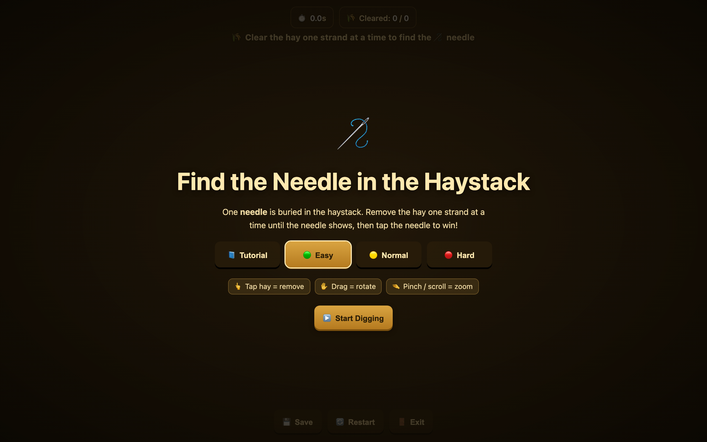

# 🪡 Haystack Hunt

A tiny 3D "find the needle in a haystack" game built with [Three.js](https://threejs.org/). Dig through a pile of hay one strand at a time until the hidden needle shows, then tap it to win.



> Part of the **one-day-one-code** repo — see the full catalog in [`../index.html`](../index.html).

## Play

Just open `index.html` in a browser. For best results (CDN modules load cleanly) serve it locally:

```bash
python3 -m http.server 8000
# then open http://localhost:8000
```

> Requires an internet connection — Three.js is loaded from a CDN.

## Features

- **Thousands of hay strands** rendered efficiently with a single `InstancedMesh`.
- **Pick one strand at a time** — click/tap the front-most strand to remove it (with a flying-away animation).
- **Collapse physics** — hay above a gap falls to fill it.
- **Hover highlight** (desktop) shows exactly which strand you'll pick.
- **Difficulty levels**: 📘 Tutorial (1,000) · 🟢 Easy (10,000) · 🟡 Normal (50,000) · 🔴 Hard (100,000). Heavy piles auto-disable shadows & hover to stay smooth.
- The needle spawns at a **random buried spot** — never exposed at the surface.
- **Save / continue progress** via `localStorage` (the pile is regenerated deterministically from a seed).
- **Mobile-friendly**: one finger rotates, pinch zooms, tap picks.
- **Anti-spam** cooldown between picks.

## Controls

| Action | Desktop | Mobile |
| --- | --- | --- |
| Remove a strand | Click | Tap |
| Rotate the pile | Drag | One-finger drag |
| Zoom | Scroll | Pinch |
| Win | Click the needle | Tap the needle |

## Tech

Single self-contained `index.html` — Three.js + OrbitControls via ES module imports from a CDN. No build step.
