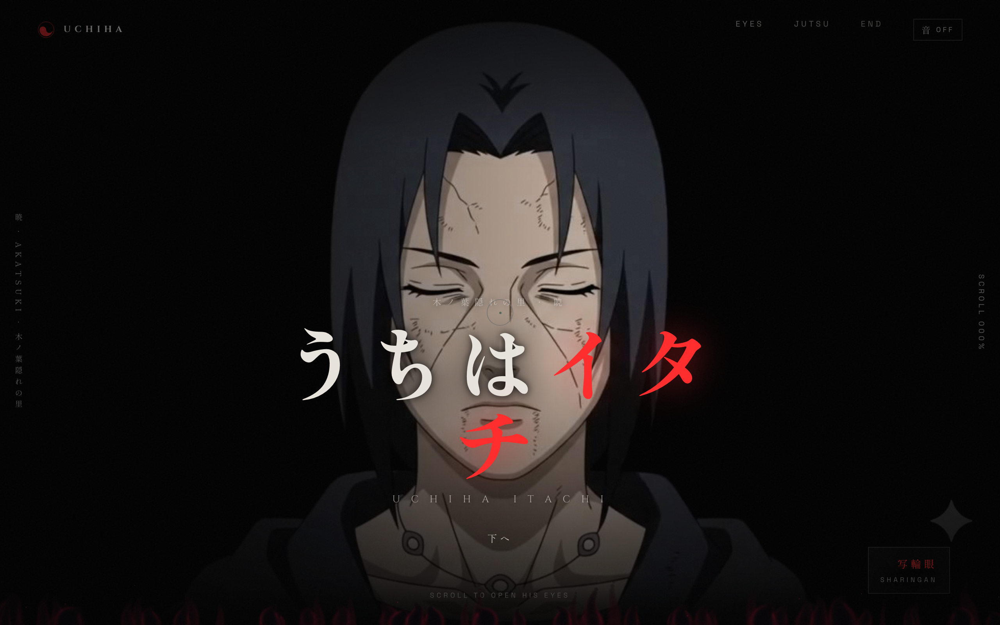

# 🔥 うちはイタチ — Uchiha Itachi Landing Page

A **cinematic** landing page themed around Uchiha Itachi (Naruto). As you scroll, a sequence of image frames plays back like a film — Itachi's eyes slowly open to reveal the **Sharingan** — complete with lightning effects, particles, and audio.



> Part of the **one-day-one-code** repo — see the full catalog in [`../index.html`](../index.html).

## Run

This page loads hundreds of image frames from the `frames/` folder, so run it through a local server (not `file://`):

```bash
python3 -m http.server 8000
# then open http://localhost:8000
```

## Features

- **Scroll-driven animation** — scroll position maps to the frame index, driving the whole cinematic sequence.
- **Two frame sequences**: `frames/main/` (71 frames) for the intro and `frames/eyes/` (51 frames) for the eyes-open → Sharingan moment.
- **Phase navigation**: `EYES · JUTSU · END` with a scroll progress indicator (`SCROLL 000%`).
- **Audio** — toggle `音 ON/OFF` for background music.
- **Visual effects** — SVG lightning bolts, glow, and layered Japanese–Latin typography.

## Structure

```
02. itachi-landing-page/
├── index.html      # Markup + SVG effects
├── style.css       # ~620 lines of styling & animation
├── main.js         # ~1000 lines: frame preload, scroll→frame, audio, effects
├── frames/
│   ├── main/       # 001.jpg … (71 frames) — intro sequence
│   ├── eyes/       # (51 frames) — Sharingan sequence
│   └── storm.jpg   # background
└── BAckup/         # asset backup
```

## Tips

- Frame preloading can be heavy on a slow connection; let the page load before scrolling fast.
- For the best experience, use a desktop browser with a wide screen.

## Tech

Vanilla JS — no framework, no build step. Frame animation is driven manually from the scroll event.

> Repo: https://github.com/FannyDevz/sharingan
