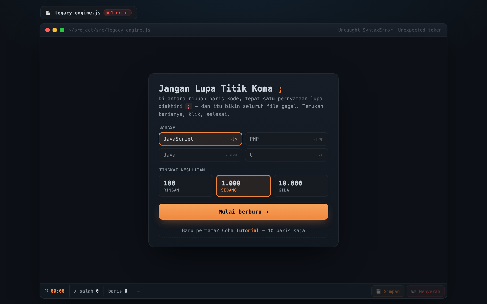

# 🧩 Jangan Lupa Titik Koma `;` (Don't Forget the Semicolon)

A small coding puzzle. Among thousands of lines of code, **exactly one** statement is missing its semicolon (`;`) — and that breaks the whole file from compiling. Your job: find the line, click it, done.



> Part of the **one-day-one-code** repo — see the full catalog in [`../index.html`](../index.html).

## Play

Open `index.html` directly in a browser — this project is fully static and self-contained.

```bash
# optional, via local server
python3 -m http.server 8000   # then open http://localhost:8000
```

## Features

- **Pick a language**: JavaScript `.js`, PHP `.php`, Java `.java`, or C `.c` — the code syntax adapts.
- **Difficulty** by line count: **100** (Light) · **1,000** (Medium) · **10,000** (Insane).
- **Tutorial mode** — just 10 lines to warm up.
- **Editor look-and-feel** — resembles a code editor with an error indicator (`1 error`, `Uncaught SyntaxError`).
- **Stats** — timer, wrong-guess count, and line number.
- **Save progress** and a give-up option.

## How to play

1. Pick a language & difficulty, then **Start hunting**.
2. Scroll/scan the displayed code.
3. Click the line you think is missing the `;`.
4. Correct → you win. Wrong → the "wrong" counter goes up.

## Tech

Single-file `index.html` (~730 lines) — HTML + CSS + Vanilla JS, no dependencies and no build step.
