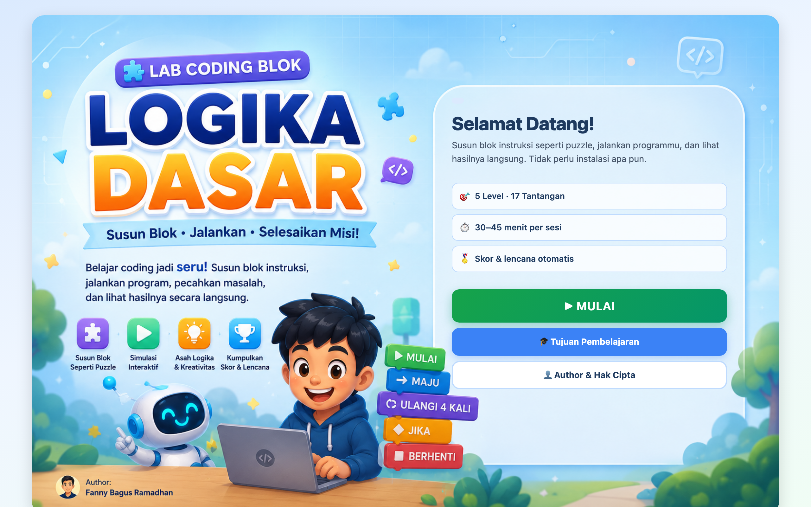

# 🧱 Block-Coding for Basic Logic Lab

A **visual block-coding** lab. Snap picture-based instruction blocks together like a puzzle — *Move, Turn, Repeat N, Repeat Forever, If-Then, If-Else, Variable, Print, Stop* — then run the animation to watch your program play out. Guide a robot past obstacles, auto-harvest a garden, or program a traffic light. Made to build **computational thinking** for junior-high-level equivalence education (Paket B, Fase D).



> Part of the **one-day-one-code** repo — see the full catalog in [`../index.html`](../index.html).

## Play

Open `index.html` directly in a browser — fully static, no server or install needed.

```bash
# optional, via local server
python3 -m http.server 8000   # then open http://localhost:8000
```

## Features

- **5 levels · 17 challenges** of increasing difficulty.
- **Drag & drop blocks** into the program area, including **nested blocks** (blocks inside loops/conditionals).
- **Real-time simulation** — the animation runs the program you assembled; errors just mean "try again", no penalty.
- **Auto scoring** with achievement badges, plus a **reflection journal** saved to `localStorage`.
- **Mobile-friendly** — tabbed panels (Blocks / Program / Simulation) and **tap-to-pick + tap-to-place** in place of drag-and-drop on touch screens.

## Tech

HTML5 + CSS3 + Vanilla JavaScript (`app.js`, `engine.js`, `levels.js`) — no framework, no build step. HTML5 Drag & Drop API on desktop, tap-to-place on mobile; progress persisted via `localStorage`.

> By **Fanny Bagus Ramadhan** — [fanny.dev](https://fanny.dev) · Ruang Murid, Rumah Pendidikan
