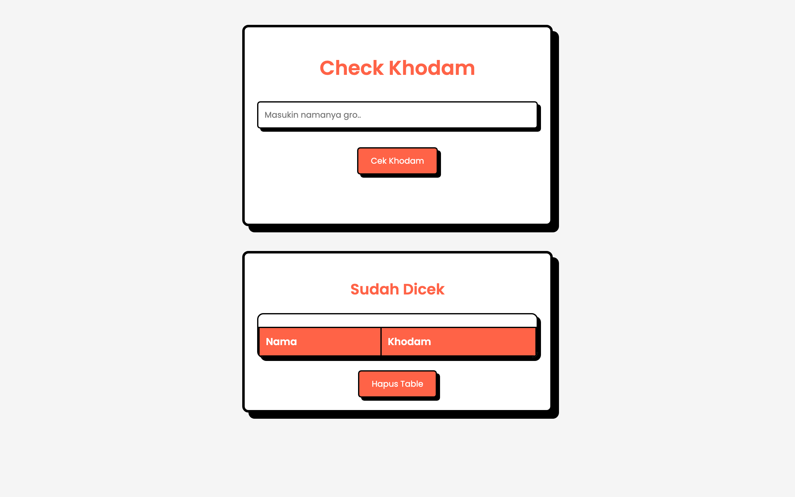

# 👻 Check Khodam

A tiny, tongue-in-cheek take on the Indonesian **"cek khodam"** meme. Type a name, hit **Cek Khodam**, and get a randomly assigned *khodam* (guardian spirit) — from serious-sounding spirits to fried chicken, Whiskas, and Free Fire. Every result is logged into a table so you can compare with friends.



> Part of the **one-day-one-code** repo — see the full catalog in [`../index.html`](../index.html).

## Play

Open `index.html` directly in a browser — fully static, no server needed.

```bash
# optional, via local server
python3 -m http.server 8000   # then open http://localhost:8000
```

## Features

- **Name → random khodam** — picks a random entry from the built-in khodam pool.
- **History table** of everyone you've checked, with a **Clear** button.
- **Persistent** — results are saved to `localStorage` and reloaded on the next visit.
- **Editable list** — add your own entries to the `KHODAM_LIST` array at the top of `js/script.js` (`khodam/list.txt` keeps the original source list).

## Tech

Single-page HTML + CSS (`css/styles.css`) + Vanilla JS (`js/script.js`) — no framework, no build step, no backend. The khodam pool is embedded inline in the JS, so it works even over `file://`.
