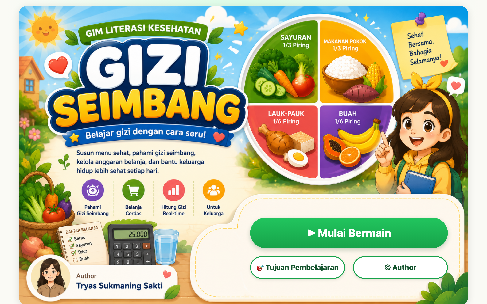

# 🥗 Gizi Seimbang — Nutrition Health Literacy Game

A **drag-and-drop nutrition game** about building balanced meals. Drag foods from the shelf onto the right plate zones, watch calories, protein, carbs, fat, and fiber update in real time, and chase a nutrition score of 0–100. Built for junior-high-level equivalence education (Paket B), with food data grounded in **TKPI Kemenkes RI** and the **AKG (Permenkes No. 28/2019)**.



> Part of the **one-day-one-code** repo — see the full catalog in [`../index.html`](../index.html).

## Play

Open `index.html` directly in a browser — fully static, no server or install needed.

```bash
# optional, via local server
python3 -m http.server 8000   # then open http://localhost:8000
```

## Features

- **5 levels × 2–3 challenges = 14 challenges**, with a step-by-step stepper — the next challenge unlocks only when the current one is done.
- **40+ real foods** (from TKPI Kemenkes RI) with **strict category validation** — a food only drops into its matching zone; wrong drops shake red with an educational hint.
- **Real-time nutrition panel** (bar chart) and a **shopping budget** (levels 2 & 5B) that update as you add or remove foods.
- **3 badges** (Family Nutritionist, Smart Shopper, Score 300+) plus a 2-question **reflection journal** per level, saved to `localStorage` (`gim-gizi-v1`).
- **Accessible & mobile-first** — 3-step onboarding, tabbed panels (Foods / Plate / Nutrition), tap-to-pick + tap-to-place, ≥44×44px touch targets, and `prefers-reduced-motion` support.

## Tech

HTML5 + CSS3 + Vanilla JavaScript (`app.js`, `data.js`, `levels.js`) — no framework, no build step. HTML5 Drag & Drop API on desktop, tap-to-place on mobile; scores, badges, and journal persisted via `localStorage`.

> By **Tryas Sukmaning Sakti** · Ruang Murid, Rumah Pendidikan
