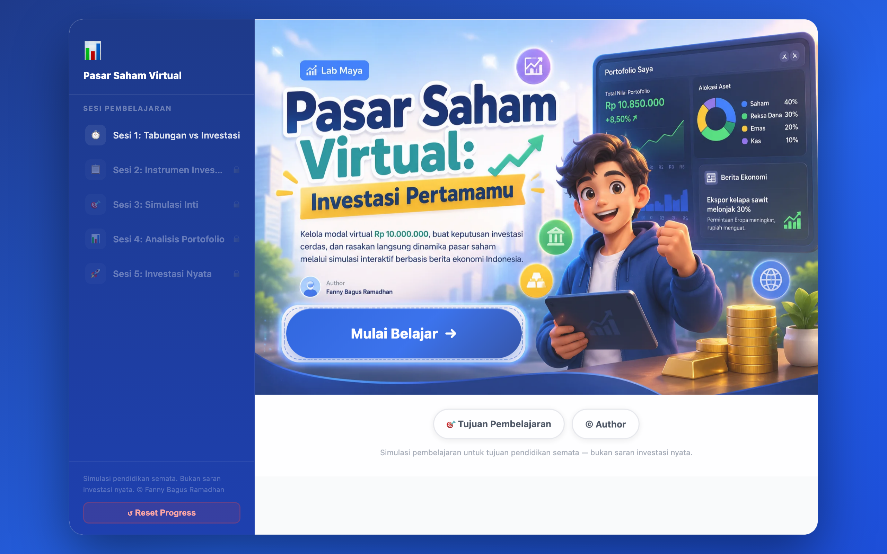

# 📈 Pasar Saham Virtual — Virtual Stock Market

A **virtual investing simulator** built as a self-contained web app (SCORM 1.2) for senior-high-level equivalence education (Paket C). Learners get a virtual **Rp 10,000,000** and manage it across stocks, a money-market fund, gold, and cash through **5 rounds** of Indonesian economic-news scenarios — learning diversification, risk profiles, and inflation along the way.



> Part of the **one-day-one-code** repo — see the full catalog in [`../index.html`](../index.html).

> **Disclaimer:** an educational simulation only. All instruments, prices, and scenarios are fictional, do not reflect real markets, and are not investment advice.

## Run

Pure HTML/CSS/JS with no build step, but it **can't be opened via `file://`** — the Service Worker and `manifest.json` need an HTTP origin. Serve it statically:

```bash
python3 -m http.server 8000   # then open http://localhost:8000
# or: npx serve .
```

Outside an LMS, `window.API` is absent so SCORM tracking is skipped without errors — progress still persists to `localStorage`.

## Features

- **5 sessions** — savings vs. investing (with an inflation calculator), instrument cards, the core 5-round simulation, portfolio analysis, and real-investing guidance, plus a wrap-up screen.
- **Investor-profile quiz** → suggested allocation, then allocation sliders + SVG charts across 5 news-driven rounds.
- **8 behavior-based badges** — e.g. *Tameng Emas* only unlocks if you hold gold ≥ 15% exactly in Round 4 as the rupiah weakens.
- **Auto scoring & SCORM** — per-session scores roll up into `cmi.core.score.raw`; `passed` at ≥ 70.
- **Offline-ready PWA** — cache-first Service Worker; mobile-first and WCAG 2.1 AA-minded, honoring `prefers-reduced-motion`.

## Structure

```
06. investment-simulator/
├── index.html        # App shell — 11 empty <section> screens filled by JS at runtime
├── js/data.js        # All learning content: instruments, 5 news rounds, quizzes, badges
├── js/app.js         # State, routing, quiz engine, portfolio sim, charts, SCORM, persistence
├── css/main.css      # Mobile-first styling
├── sw.js             # Service Worker (cache-first, offline)
├── manifest.json     # PWA manifest
└── Module Ajar/      # Teaching module & dev docs (PDF/DOCX)
```

## Tech

Vanilla ES6+ JavaScript, zero external libraries. One global state object (`S`) persisted to `localStorage` (`psv_state_v1`), manual screen routing, a shared quiz engine, and inline SVG charts. Bump the `CACHE` constant in `sw.js` whenever assets change.

> By **Fanny Bagus Ramadhan** — [fanny.dev](https://fanny.dev) · Paket C, Ruang Murid, Rumah Pendidikan
