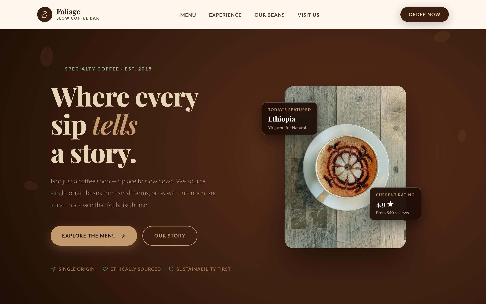

# ☕ Foliage — Slow Coffee Bar

A warm, editorial landing page for a fictional specialty coffee bar. A floating cup hero with a live "today's featured bean" card and rating, then story, menu, experience, a bean-sourcing journey, testimonials, and a visit/order call-to-action.



> Part of the **one-day-one-code** repo — see the full catalog in [`../index.html`](../index.html).

## Run

Open `index.html` directly in a browser — it's a self-contained single file. Google Fonts load from a CDN, so an internet connection gives the intended typography; it still works offline with system-font fallbacks.

```bash
# optional, via local server
python3 -m http.server 8000   # then open http://localhost:8000
```

## Sections

- **Hero** — "Where every sip tells a story" with a floating cup, featured-bean card, and rating.
- **Our Story · Menu · Experience** — the brand narrative and offerings.
- **Our Beans** — a single-origin sourcing journey.
- **Testimonials · Visit** — community quotes and location / order CTA.

## Tech

A single `index.html` — inline CSS + Vanilla JS, no framework and no build step. Scroll-based reveals and hover interactions in plain JS; typography via Playfair Display + Lato (Google Fonts).
