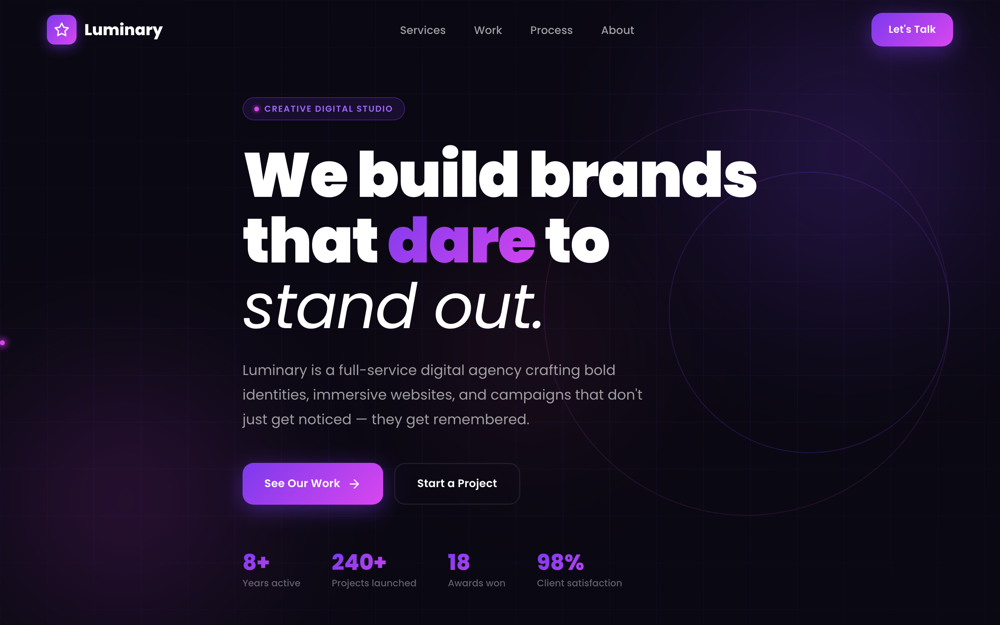

# ✨ Luminary Studio — Digital Agency

A bold, dark landing page for a fictional creative digital agency. A gradient "We build brands that dare to stand out" hero with animated stat counters (years active, projects, awards, satisfaction), then services, work, process, about, testimonials, and contact.



> Part of the **one-day-one-code** repo — see the full catalog in [`../index.html`](../index.html).

## Run

Open `index.html` directly in a browser — it's a self-contained single file. Google Fonts load from a CDN, so an internet connection gives the intended typography; it still works offline with system-font fallbacks.

```bash
# optional, via local server
python3 -m http.server 8000   # then open http://localhost:8000
```

## Sections

- **Hero** — gradient headline with animated stats (8+ years · 240+ projects · 18 awards · 98% satisfaction).
- **Services · Work · Process** — what they do and how they do it.
- **About · Testimonials · Contact** — the studio, client quotes, and a "Let's build something" CTA.

## Tech

A single `index.html` — inline CSS + Vanilla JS, no framework and no build step. Gradient/glow visuals in CSS, scroll reveals and count-up stats in plain JS; typography via Poppins (Google Fonts).
