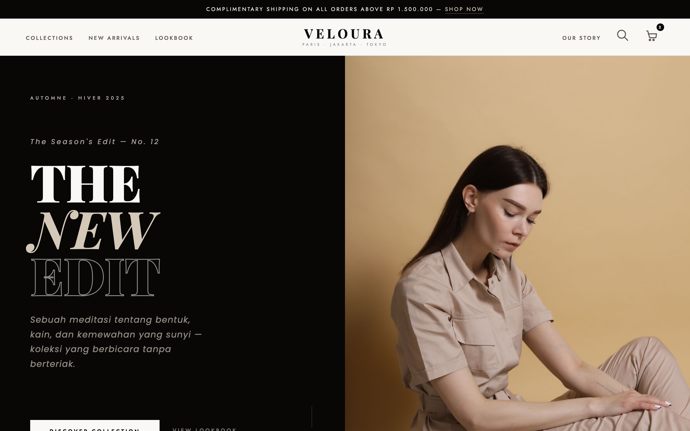

# 🖤 VELOURA — Fashion Brand

An editorial landing page for a fictional luxury fashion house (Automne · Hiver 2025). A split black/beige hero with "The New Edit", a running announcement bar and cart counter, a product grid of new arrivals, and a quiet manifesto section.



> Part of the **one-day-one-code** repo — see the full catalog in [`../index.html`](../index.html).

## Run

Open `index.html` directly in a browser — it's a self-contained single file. Google Fonts load from a CDN, so an internet connection gives the intended typography; it still works offline with system-font fallbacks.

```bash
# optional, via local server
python3 -m http.server 8000   # then open http://localhost:8000
```

## Sections

- **Announcement bar + nav** — Collections · New Arrivals · Lookbook · Our Story, with search and a cart badge.
- **Editorial hero** — split-screen "The New Edit" with a lookbook-style mannequin illustration.
- **Products** — a new-arrivals grid.
- **Manifesto** — the brand's quiet-luxury statement (Indonesian copy).

## Tech

A single `index.html` — inline CSS + Vanilla JS, no framework and no build step. All imagery is CSS/SVG-based (no external assets); typography via Playfair Display + Montserrat + Cormorant Garamond (Google Fonts).
