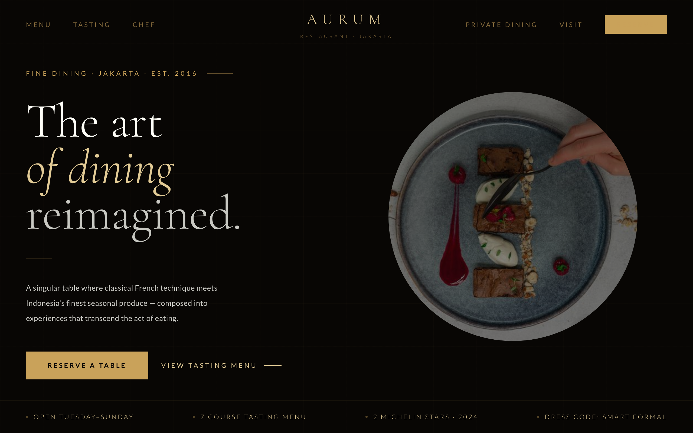

# 🍽️ Aurum — Fine Dining Restaurant

A luxury landing page for a fictional fine-dining restaurant in Jakarta. A cinematic dark-and-gold hero ("The art of dining reimagined"), signature dishes, a 7-course tasting menu, the chef's story, private dining, and a reservation form.



> Part of the **one-day-one-code** repo — see the full catalog in [`../index.html`](../index.html).

## Run

Open `index.html` directly in a browser — it's a self-contained single file. Google Fonts load from a CDN, so an internet connection gives the intended typography; it still works offline with system-font fallbacks.

```bash
# optional, via local server
python3 -m http.server 8000   # then open http://localhost:8000
```

## Sections

- **Hero** — gold-on-black headline with an info strip (open days · 7-course tasting · 2 Michelin stars · dress code).
- **Dishes · Tasting** — signature plates and the full tasting menu.
- **Chef · Private Dining** — the kitchen's story and event spaces.
- **Reservation · Visit** — booking form and location.

## Tech

A single `index.html` — inline CSS + Vanilla JS, no framework and no build step. Refined type scale and scroll reveals in plain JS; typography via Cormorant Garamond + Lato (Google Fonts).
