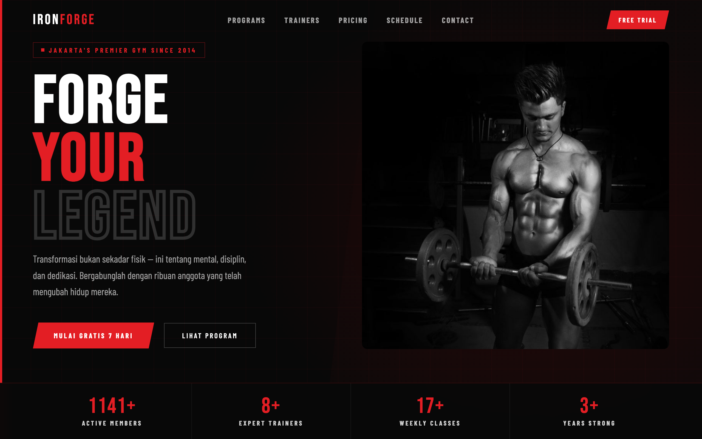

# 🏋️ IRONFORGE — Gym Landing Page

A high-energy landing page for a fictional Jakarta gym. Oversized "Forge Your Legend" type over a dark red-lit hero with animated stats (members, trainers, classes, years), then programs, features, trainers, pricing tiers, a weekly schedule, and testimonials. Copy is in Indonesian.



> Part of the **one-day-one-code** repo — see the full catalog in [`../index.html`](../index.html).

## Run

Open `index.html` directly in a browser — it's a self-contained single file. Google Fonts load from a CDN, so an internet connection gives the intended typography; it still works offline with system-font fallbacks.

```bash
# optional, via local server
python3 -m http.server 8000   # then open http://localhost:8000
```

## Sections

- **Hero** — "Forge Your Legend" with a barbell illustration and stat row (1061+ members · 7+ trainers · 15+ classes · 3+ years).
- **Programs · Features · Trainers** — training tracks, facilities, and the coaching team.
- **Pricing** — three membership tiers (Starter · Elite · Legend).
- **Schedule · Testimonials · CTA** — weekly classes, member stories, and a 7-day free-trial call-to-action.

## Tech

A single `index.html` — inline CSS + Vanilla JS, no framework and no build step. Angular/clip-path styling and count-up stats in plain JS; typography via Bebas Neue + Barlow Condensed + Inter (Google Fonts).
