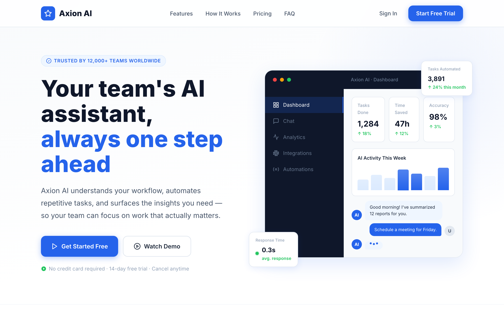

# 🤖 Axion AI — SaaS Landing Page

A clean, modern landing page for a fictional AI work-assistant SaaS. A light hero with a floating product-dashboard mockup ("Your team's AI assistant, always one step ahead"), then a feature grid, how-it-works steps, testimonials, pricing, and an FAQ.



> Part of the **one-day-one-code** repo — see the full catalog in [`../index.html`](../index.html).

## Run

Open `index.html` directly in a browser — it's a self-contained single file. Google Fonts load from a CDN, so an internet connection gives the intended typography; it still works offline with system-font fallbacks.

```bash
# optional, via local server
python3 -m http.server 8000   # then open http://localhost:8000
```

## Sections

- **Hero** — headline + CTAs over a dashboard-mockup card (tasks done, time saved, accuracy, live chat).
- **Features · How It Works** — the product's capabilities and onboarding steps.
- **Testimonials · Pricing · FAQ** — social proof, plan tiers, and common questions.

## Tech

A single `index.html` — inline CSS + Vanilla JS, no framework and no build step. The dashboard mockup is pure HTML/CSS (SVG charts, no images); interactive FAQ accordion and scroll reveals in plain JS; typography via Inter (Google Fonts).
